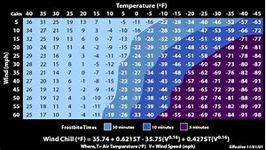

## 练习题

---

1. 编写一个函数，用于将浮点数取整为与其最接近的整数，类似于 `Math.round`。例如，假设我们有一个浮点数变量 `x`，我们可以通过将变量加上 0.5 并舍去小数部分来得到其最接近的整数。因为数值四舍五入取整时会朝着数轴上 0 的方向，所以负数取整时需要将其数值减去 0.5，而不是加上 0.5。

2. 我们已经知道 JavaScript 可以使用二进制、八进制、十进制和十六进制的数字形式，也可以自己动手，将数字转换为其它进制的字符串形式。假设要将数字 n 转换为以 b 为基数的数字，实现转换的算法如下。
   1. 设置最高位为 n % b，存入一个数组。
   2. 使用 n / b 代替 n。
   3. 重复步骤 1 和 2，直到 n 为 0，且没有余数。
   4. 将整个数组顺序逆转，连接成的字符串就是转换后的 b 进制数字字符串。

3. 如果你碰上寒冷、大风的天气，你对温度的感觉不仅取决于温度，还取决于风速。风速越高，越觉得寒冷。为了量化风速对于温度感觉的影响，美国国家气象局提供了风寒指数报告，其官网上的说明如下：

   

   正如你在图片底部所看到的，气象局使用以下公式计算风寒指数：

   $$ 35.74 + 0.6215 t - 35.75 v ^ {0.16} + 0.4725t v ^ {0.16} $$

   其中，$$t$$是华氏温度，$$v$$是风速，单位是$$ 英里/小时 $$。

   编写一个函数 `windChill`，参数为 t 和 v，返回风寒指数。为了达到这一目的，你的函数必须考虑以下情况：

   - 如果没有风，`windChill` 必须返回原始温度 t。
   - 如果温度高于 $$40 ℉ $$，风寒指数未定义，此时你应当考虑如何输出错误信息。

   

4. 世界上的大部分人们使用摄氏度而非华氏度，包括我们。因此为了适应我们的习惯，编写一个华氏度转到摄氏度的函数，并基于此来计算风寒指数。我们在第三章中了解过温度转换的方法，现在是发挥作用的时候。

5. 实现一个将英语基数词转换为序数词的函数。

   我们小学时学过这样的规则口诀：

   > 基变序，有规律，词尾加上“th”；
   >
   > 一，二，三（first、second、third）特殊记；
   >
   > 从 4 开始上 th，5 变 ve 改f（fifth），8 去 t（eighth），9 减 e（ninth）；
   >
   > 几十尾巴 ty 变 tie，后面跟上th（twentieth）；
   >
   > 几十几，头不变，尾巴变，中间记得加个杠（twenty-fourth）；
   >
   > 遇到特殊要除外（twenty-first）。

   

6. 实现一个将英语动词转换为现在分词形式的函数。

   规则：

   1. 一般情况下，直接在动词原形后面加 -ing。
   2. 结尾是辅音+一个元音+一个辅音的，重复最后一个辅音字母，再加 -ing。
   3. 以不发音的 -e 结尾的动词，去 -e ，再加 -ing。

7. 实现一个将阿拉伯数字转换为罗马数字的函数。

   罗马数字共有 7 个，即 I（1）、V（5）、X（10）、L（50）、C（100）、D（500）和M（1000）。按照下述的规则可以表示任意正整数。

   - 一个罗马数字重复几次，就表示这个数的几倍。

   - 在较大的罗马数字的右边记上较小的罗马数字，表示大数字加小数字。

   - 在较大的罗马数字的左边记上较小的罗马数字，表示大数字减小数字。
   - 左减的数字有限制，仅限于I、X、C。比如45不可以写成VL，只能是XLV
   - 但是，左减时不可跨越一个位值。比如，99不可以用IC（$100-1$）表示，而是用 XCIX（$ [100-10]+[10-1] $）表示（等同于阿拉伯数字每位数字分别表示。）

8. 改进之前的罗马数字函数。

   罗马数字具有以下限制：

   - 左减数字必须为一位，比如8写成VIII，而非IIX。
   - 右加数字不可连续超过三位，比如14写成XIV，而非XIIII。（见下方“数码限制”一项。）
   - 同一数码最多只能连续出现三次，如40不可表示为XXXX，而要表示为XL。
