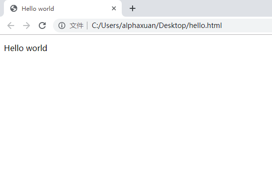

## 互联网的礼服·HTML

---

### 初识 HTML

我们已经初步接触了 JavaScript 中的表达式、值、变量、常量、输入输出等一系列最基本的内容，现在让我们把目光从运行器暂时移开，为将来的长远发展做打算。

如前文所说，JavaScript 是一种运行在浏览器中的编程语言。假如离开了这个运行器，它究竟是怎样运行的呢？我们该做些什么呢？

讨论这个之前，让我们先了解一下 HTML（HyperText Markup Language，超文本标记语言）的概念。

HTML 是你所看到的每一个 Web 页面的原始形式。浏览器将获得的 HTML 代码进行处理，就成了你上网时浏览到的每一行文字、每一张图片、每一个链接，每一个按钮、菜单、输入框。现在我们来编写一个最简单的 HTML 文档。

```html
<!DOCTYPE html>
<html>
    <head>
        <meta charset="utf-8" />
        <title>Hello world</title>
    </head>
    <body>
        <p>Hello world</p>
    </body>
</html>
```

我们将这个文档的内容保存一个文本文件里，可以叫它 `hello.html`，并尝试双击它，或者将它拖到浏览器窗口里。浏览器会显示以下画面：



看，来自我们的问候，被浏览器显示在了屏幕上。成功了！这个最简单的 HTML 的事情就是告诉浏览器：我们要将 `Hello world` 这行文本显示在屏幕上。就这么简单！那么我们刚刚写下的东西，与我们看到的问候之间，究竟有什么关系呢？不妨再来看看这个文档的内容。

首先，第一行 `<!DOCTYPE html>` 被称为 *DTD 标记*。它的作用是告诉浏览器：我们这个文档遵循最新的 HTML 5 标准，这样我们就可以享受一些便利。其后的 `<html>` 是一个*标签*，而最后一行的 `</html>` 则是一个*闭合标签*。相对地，`<html>` 被称为*开放标签*。`<html>` 和 `</html>` 是一个 HTML 文档的*根元素*，这对元素中包含了整个 HTML 文档的实际内容。

第三行的 `<head>` 与 `<html>` 标签类似，它也有一个闭合标签 `</head>`。`<head>` 被称为*头元素*，用于说明文档的一些基本信息。这个文档的头元素中包含了两行内容：

- `<meta charset="utf-8" />` ，它告诉浏览器这个文档应该根据 UTF-8 编码方式被解析。我们将在第三章了解编码方式的相关内容。它是一个*孤立标签*，因此我们把斜杠 `/` 写在它的后面。
- `<title>Hello world</title>` 将浏览器顶部的页面标题更改为 Hello world，这样我们在浏览多个页面的时候，就会知道每个标签页是什么内容。

`<head>` 标签后的 `<body>` 标签包含了我们实际看见的页面内容，在这里写下的任何东西，都会以某种方式被浏览器呈现出来。我们不需要显示其他什么东西，因此我们就添加了一个*段落*，内容是 Hello world，用一对 `<p>` 标签包裹起来。


---

Story：

1980年，物理学家蒂姆·伯纳斯-李在欧洲核子研究中心（CERN）在承包工程期间，为使 CERN 的研究人员使用并共享文档，他提出并创建原型系统 ENQUIRE。1989年，伯纳斯-李在一份备忘录中提出一个基于互联网的超文本系统。他规定HTML 并在 1990 年底写出浏览器和服务器软件。同年，伯纳斯-李与 CERN 的数据系统工程师罗伯特·卡里奥联合为项目申请资助，但未被 CERN 正式批准。在他的个人笔记中，伯纳斯-李列举“一些使用超文本的领域”，并把网络百科全书列为首位。

HTML 的首个公开描述出现于一个名为“HTML 标签”的文件中，由蒂姆·伯纳斯-李于 1991 年底提及。它描述 18 个元素，包括 HTML 初始的、相对简单的设计。除了超链接标签外，其他设计都深受 CERN 内部一个以标准通用标记语言（SGML）为基础的文件格式 SGMLguid 的影响。这些元素在 HTML 4 中仍有 11 个存在。

伯纳斯-李认为 HTML 是 SGML 的一个应用。1993年中期互联网工程任务组（IETF）发布首个 HTML 规范的提案：“超文本标记语言（HTML）”互联网草案，由伯纳斯-李与丹·康纳利撰写。其中包括一个 SGML 文档类型定义来定义语法。草案于 6 个月后过期，但是它带来了由 Masaic 创造的在页面上显示图片的特性。同时，戴夫·拉格特在 1993 年末提出的与之竞争的互联网草案“HTML+（超文本标记格式）”，最终引入了诸如表格与填写表单的功能。

在 HTML 和 HTML+ 的草案于 1994 年初到期后，IETF 创建了一个 HTML 工作组，并在 1995 年完成“HTML 2.0”，这是第一个旨在成为对其后续实现标准的依据的 HTML 规范。

在 IETF 的主持下，HTML 标准的进一步发展因竞争利益而遭受停滞。自 1996 年起，HTML 规范一直由万维网联盟（W3C）维护，并由商业软件厂商出资支持。不过在 2000 年，HTML 也成为国际标准（ISO/ IEC 15445：2000）。HTML 4.01 于1 999 年末发布，进一步的勘误版本于 2001 年发布。2004 年，网页超文本应用技术工作小组（WHATWG）开始开发 HTML 5，并在 2008 年与 W3C 共同交付，2014 年 10 月 28 日完成标准化。

---


### 表格

表格是由行和列组成的*结构化数据集*，能够使我们简便迅捷地查找某个值的位置或是一组值的某种关系，例如姓名与年龄的对应关系、学校课程表、游泳池的时刻表等。


> 图片来源：https://mdn.mozillademos.org/files/14583/numbers-table.png，Mozilla Developer Network


> 图片来源：https://mdn.mozillademos.org/files/14587/swimming-timetable.png，Mozilla Developer Network

表格在人类社会中很常见，而且已经存在很长时间了，下面这张 1800 年美国的人口普查表就足以反映。


> 图片来源：https://mdn.mozillademos.org/files/14585/1800-census.jpg，Mozilla Developer Network

常见的文档处理程序，如 Microsoft Office Word 等，都提供了电子表格的支持，HTML 也拥有一套方法来处理和呈现 Web 上表格形式的数据。

表格的一大特点是**严格**，通过在行和列的标题之间进行*视觉关联*的方法，使大量信息得以被快速有效地解读与判断。我们观察如下表格，当我们要快速查询特定的单复数、人称、性别所对应的人称时，表格的结构化就提供了极大地便利。

<table>
<tbody>
  <tr>
   <th colspan="3"></th>
   <th scope="col">Subject</th>
   <th scope="col">Object</th>
  </tr>
  <tr>
   <th rowspan="5" scope="rowgroup">单数</th>
   <th colspan="2" scope="row">第一人称</th>
   <td>I</td>
   <td>me</td>
  </tr>
  <tr>
   <th colspan="2" scope="row">第二人称</th>
   <td>you</td>
   <td>you</td>
  </tr>
  <tr>
   <th rowspan="3" scope="rowgroup">第三人称</th>
   <th class="symbol" scope="row">♂</th>
   <td>he</td>
   <td>him</td>
  </tr>
  <tr>
   <th class="symbol" scope="row">♀</th>
   <td>she</td>
   <td>her</td>
  </tr>
  <tr>
   <th class="symbol" scope="row">other</th>
   <td>it</td>
   <td>it</td>
  </tr>
  <tr>
   <th rowspan="3" scope="rowgroup">复数</th>
   <th colspan="2" scope="row">第一人称</th>
   <td>we</td>
   <td>us</td>
  </tr>
  <tr>
   <th colspan="2" scope="row">第二人称</th>
   <td>you</td>
   <td>you</td>
  </tr>
  <tr>
   <th colspan="2" scope="row">第三人称</th>
   <td>they</td>
   <td>them</td>
  </tr>
</tbody>
</table>

表格在信息技术领域所承担的重要作用超越了本书的范围。除了文字处理程序提供的便捷的表格操作，在 HTML 里纯手工“画”一个表格也并非什么难事。下面，我们将动手创建一个可爱的 HTML 表格。

- 所有的表格都包含在 `<table></table>` 这对标签中，我们首先在 HTML 源代码里添加这些内容。

- 我们知道，表格是由一个个单元格构成的。一个单元格就是一对 `<td></td>` 标签，其中包含单元格将会呈现的内容。我们把下面的内容添加到 `<table>` 标签内。

  ```html
  <td>你好！我是第一个单元格~</td>
  ```

  如果我们想要一行四个单元格，我们需要把这组标签复制三次。

  ```html
  <td>你好！我是第一个单元格~</td>
  <td>我是第二个单元格</td>
  <td>我是第三个单元格</td>
  <td>我是第四个单元格</td>
  ```

  四个单元格呈现出这样的效果：

  

  你会看到, 单元格不会放置在彼此的下方, 而是自动与同一行上的其他单元格对齐. 每个 `<td>` 元素 创建一个单独单元格，它们共同组成了第一行。同时，表格并没有呈现出我们通常所见的分隔线。在后续的章节中，我们将了解到如何使用*样式*，来使表格看起来更像是“经典”的表格。

- 如果想停止在这一行添加单元格，并开启新的一行，我们需要使用 `<tr>` 元素。

  1. 把已经创建好的 4 个单元格放入 `<tr>` 标签， 就像这样：

     ```html
     <tr>
         <td>你好！我是第一个单元格~</td>
         <td>我是第二个单元格</td>
         <td>我是第三个单元格</td>
         <td>我是第四个单元格</td>
     </tr>
     ```

  2. 现在我们已经拥有了完整的一行，可以继续增加至两行、三行。每一行都需要包裹在专属的 `<tr>` 标签中，`<tr>` 标签内只能存放 `<td>` 单元格。

  3. 我们得到了一个类似这样的表格：

  | 你好！我是第一个单元格~ | 我是第二个单元格 | 我是第三个单元格 | 我是第四个单元格 |
  | ----------------------- | ---------------- | ---------------- | ---------------- |
  | 第二行第一个单元格      | 呜呜呜           | 好寂寞           | 谁来陪我鸭       |

   而实际呈现的效果大致是如下：

  

- 现在，让我们把注意力转向表格标题，表格中的标题是特殊的单元格，通常在行或列的开始处，定义行或列包含的数据类别。我们可以看一下这个例子（来自 Mozilla Developer Network）：

```html
<table>
  <tr>
    <td> </td>
    <td>Knocky</td>
    <td>Flor</td>
    <td>Ella</td>
    <td>Juan</td>
  </tr>
  <tr>
    <td>Breed</td>
    <td>Jack Russell</td>
    <td>Poodle</td>
    <td>Streetdog</td>
    <td>Cocker Spaniel</td>
  </tr>
  <tr>
    <td>Age</td>
    <td>16</td>
    <td>9</td>
    <td>10</td>
    <td>5</td>
  </tr>
  <tr>
    <td>Owner</td>
    <td>Mother-in-law</td>
    <td>Me</td>
    <td>Me</td>
    <td>Sister-in-law</td>
  </tr>
  <tr>
    <td>Eating Habits</td>
    <td>Eats everyone's leftovers</td>
    <td>Nibbles at food</td>
    <td>Hearty eater</td>
    <td>Will eat till he explodes</td>
  </tr>
</table>
```

以上源代码大致呈现出这样的效果：

|               | Knocky                    | Flor            | Ella         | Juan                      |
| ------------- | ------------------------- | --------------- | ------------ | ------------------------- |
| Breed         | Jack Russell              | Poodle          | Streetdog    | Cocker Spaniel            |
| Age           | 16                        | 9               | 10           | 5                         |
| Owner         | Mother-in-law             | Me              | Me           | Sister-in-law             |
| Eating Habits | Eats everyone's leftovers | Nibbles at food | Hearty eater | Will eat till he explodes |

我们也可以使用专门的 `<th>` 标签来定义表格标题。

------

Note：

`<table>`、`<td>`、`<tr>`、`<th>` 这些标签都是什么意思？

`table` 在英语中除了有桌子的含义，也用于指代表格。

`td` 是*表格数据*（table data）的缩写。

`tr` 是*表格行*（table raw）的缩写。

`th` 是*表格标题*（table header）的缩写。

------

