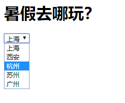
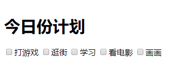
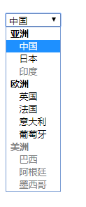

## 高屋建瓴·HTML 控件

---

### 控件的概念

*控件*（widget）是一个很广泛的概念，它的字面含义是“可以由用户控制的组件”，包括你在使用桌面和 Web 应用时看到的那些按钮、文本框、滑动条、图片、菜单等。它们为用户和应用程序提供了一个便捷的交流途径，合适的控件使应用程序的意图得以良好传达，给用户以良好的使用体验。所有页面上的元素，只要能对用户进行的一定操作进行响应，改变状态或做出其它反馈，或专门负责传达某一类信息，都可以被称为控件。

开发者在使用控件时，应当考虑两大因素，一是**语义清晰**，而是**用户友好**。按钮就是一类语义非常清楚的控件，当用户看见它时，就会知道应该点击它来达到一定目的。所有的按钮都是基于这种固有经验。在此基础上，承担不同任务的按钮可能会被赋予不同的样式或提示信息。按钮中间可以显示点说明作用的文本。

```html
<button>
    点击我！
</button>
```

在大多数 Web 浏览器上，一个默认的按钮都会呈现为灰色的矩形方块，静止状态、鼠标移上、点击时、点击后对应的效果都会发生改变，体现了按钮操作时的质感。（在作者所使用的的浏览器上只会发生光影变化）


另一对例子是*单选按钮*和*下拉菜单*。单选按钮与普通的按钮有所不同，相信你一定见过它：


如果要让用户在三四个选项里做出唯一选择，显然单选按钮是很合适的。当用户改变要改变选择时，只需要点击另一个选项前的圆框。但是选项和内容一多，全部平铺堆积在页面上，看上去显得杂乱无章。当用户不需要做出选择时，还会带给用户冗余的视觉信息。



而下拉菜单默认状态下只会显示一行文本，当我们单击它时，就会弹出所有的选项——我们知道它弹出的内容不是通知或别的什么东西，而是供我们做出选择的选项。显示选项让用户做出选择，是单选按钮和下拉带单共有的语义。但当用户不需要做出选择时，下拉菜单会隐藏大部分内容，等到时机合适时再显示，不会给用户做出视觉上的困扰，这时下拉菜单就比单选按钮更加用户友好。而只有少量选项时，单选按钮要求用户做的事情更加一目了然，省去了单击才能显示所有选项的步骤，这时单选按钮比下拉菜单更加用户友好。

编写 HTML 是显示控件的一种基本方式。HTML 页面上可以使用的控件有十几种，我们将在下文中了解到大部分控件的具体使用。


### 生成控件的元素

**1. input**

HTML 中有许多元素和属性可以生成特定的控件。其中一个重要的元素是 `<input>`，它本身在默认情况下会显示为一个空白的单行纯文本输入框（简称*文本输入框*），我们通常将它的 `type` 属性设置为 `"text"` 来强调它是一个“输入纯文本”的控件。通过将 `type` 属性设置为不同的值，`<input>` 元素所产生的控件外观与作用也各不相同。在前面的温度转换器示例中，我们使用了文本输入框与数字输入框两类控件用于接收用户输入。其中，数字输入框在点击后，右侧会显示一对上下箭头，我们可以借助于此对输入的数值进行微调。


文本输入框的一种变体专门用于输入密码，它是 `<input type="password">`，称为*密码输入框*。它和文本输入框一样接受文本输入，同时将停留在框内的文本显示为遮盖黑点。

另一个我们见过的控件是按钮。它也可以被视为输入控件的一种，因此

```html
<input type="button" value="点击我" />
```

 会被渲染为：


不过更方便的写法还是直接使用 `<button>` 元素：

```html
<button>点击我</button>
```

在互联网中用户交互对控件的需求远不止触发按钮与文本和数字输入。通过*颜色选取控件*，我们可以在游戏中选择今天穿的衣服的颜色，抑或是给个人主页换个背景色。

```html
今天用什么颜色的口红呢？当然是 <input type="color" />
```

它在我的 Chrome 浏览器上呈现为一个颜色按钮，单击它后会打开一个对话框来让我们选择颜色。


控件获取到的颜色以*HTML颜色格式*存放，关于颜色与颜色格式的相关知识我们会在第十章详细了解。

日期和时间输入同样是一类非常常见的需求。以前，页面只能提供给用户一个简陋的文本输入框，让用户自己来输入日期和时间，再根据规定的格式进行解析，如果格式写错了还会遇到意想不到的麻烦。现在 HTML 提供了一类日期和时间输入控件，它们外观上呈现为一个文本框，其中包含了预定的日期或时间格式。为了适应具体的需要，它们还分为不同的类型。

```html
我的生日：<input type="date" />
```

还可以用 `min` 和 `max` 属性为日期范围添加限制。

```html
请输入一个建国以前的日期：<input type="date" max="1949-9-30">
请输入一个21世纪的日期：<input type="date" min="2001-01-01">
```

我们可以用类似于数字输入框的上下箭头，对年月日等每一项进行微调，也可以在控件里找到一个图标，触发浏览器提供的简单日历以自由选择。


还有几种日期和时间控件，可以根据需要进行使用。

- ` <input type="datetime-local">` 提供一个类似上面的控件，不过它会忽略时区，只考虑本地时间。

- `<input type="time">` 可以用上下箭头选择一个时刻。

  （它也可能会提供一个时刻选择器，不过我的浏览器上没有 D-:）

- `<input type="month">` 精确到具体月份。

- `<input type="week">` 要求用户选择某一周。

`<input type="range">` 提供了一个滑块，可以让我们在规定范围内选择一个值，`min` 和 `max` 属性分别确定了这个范围的最小值和最大值，而 `step` 属性还可以控制每次递增或递减的程度。

```html
对 TFBoys 的好感度（0-100）：<input type="range" min="0" max="100" step="2">
```

我们对 TFboys 的好感度默认从 `50` 开始，每次至少增加或减少 `2` ，上限为 `100`，下限为 `0`。


如果我们的数据很多，写在文件里，怎么告诉页面呢？打开文件复制内容并粘贴到输入框里吗？

当然不用！我们有*文件选择控件*：`<input type="file">`

默认状态下，控件的外观是这样的：


标有“选择文件”的按钮和其后的文本都包含在控件里，单击一下，浏览器会唤起一个文件选择对话框，就像我们在 Office Word 等文档编辑软件里做的那样，选择文件并确定，控件便会显示出刚才读取到的文件的文件名。读取文件后进行的处理过程超出了本章范畴，我们将在后续有关数据处理的章节中详细了解。

以上控件能大致满足我们的基本需求，但是 Web 标准的制定者们在人性化方面做得更好，一些控件使原本需要用户“输入”的内容，变为只需“选择”，为 Web 应用程序的交互提供了莫大方便。我们在上一小节中见过的单选按钮、复选框和下拉菜单就是例子，它们已经在无数应用程序中得到了历久弥新的实践，也让网络投票与问卷这类特定需求变得轻松快捷。

单选按钮不是通常所说的按钮（专用于触发特定操作），而是列出数据以供用户进行唯一选择，它是 `type` 类型为 `"radio"` 的 `<input>` 元素。一组单选按钮的 `name` 属性相同，也就是说，如果一些单选按钮的 `name` 属性相同，那么它们会被划分为同一组，一组单选按钮中最多有一项被选中。不同 `name` 属性的单选按钮互不影响。

```html
<h1>你喜欢吃哪种水果？</h1>
<input type="radio" name="first">苹果
<input type="radio" name="first">西瓜
<input type="radio" name="first">柑橘
<input type="radio" name="first">葡萄
<h1>你喜欢吃哪种干果？</h1>
<input type="radio" name="second">核桃
<input type="radio" name="second">杏仁
<input type="radio" name="second">榛子
```

效果如图所示。


这样，选择被区分在水果与干果之间。假如把它们的 `name` 属性都变成同一个，或者原本要分成两组却用了三个 `name` ，意义就截然不同了。

另一种常见的选择控件是*复选框*，它也可以像单选按钮那样在逻辑上划分为一个个组，只不过做出的选择彼此互不干扰，我们可以单击这个复选框来*激活*它，也可以*取消激活*另一个已经激活了的复选框。复选框是 `type` 属性为 `"checkbox"` 的 `<input>` 元素。

```html
<h1>今日份计划</h1>
<input type="checkbox">打游戏
<input type="checkbox">逛街
<input type="checkbox">学习
<input type="checkbox">看电影
<input type="checkbox">画画
```

你的选择是什么呢？




---

Note：

单选按钮是 `type` 属性为 `"radio"` 的 `<input>` 元素，因为它们的外观和操作方式与老式无线电收音机（radio）上的按钮类似，如下图所示。


---


**2. select**

HTML `<select>` 标签用于创建下拉菜单控件，在单选按钮的基础上更进一步，将一组选项（option）视为一个整体，包含在一对 `<select>` 标签中。每个选项用一对 `<option>` 标签标记。下拉菜单控件被单击后，会显示所有选项，可以在其中进行选择。


一个普通的 `<select>` 标签看起来是下面这样：

```html
<select>
    <option>小猫</option>
    <option>小狗</option>
    <option>兔子</option>
    <option>仓鼠</option>
</select>
```

默认状态下下拉菜单只会显示第一个选项的内容，选中其他选项后则会显示其他选项。如果需要预先指定某个选项已经选中，那么就需要设置那个 `<option>` 标签的 `selected` 属性。

```html
<select>
    <option>小猫</option>
    <option>小狗</option>
    <option selected="selected">兔子</option>
    <option>仓鼠</option>
</select>
```

在 HTML 标签中，如果属性的名称与值一模一样，那么只需写出属性名称即可，因此 `<option selected="selected">` 也可以写成 `<option selected>`。如果需要同时选择多个选项，只需要开启 `<select>` 标签的 `multiple` 属性，这时按住 `Ctrl` 键即可进行多选。多选模式下，下拉菜单一直保持“打开”状态，因此应用以上特性后的效果如下：


如果一个下拉菜单中的选项需要按照不同类别进一步分组，使用户得以更加清晰、高效地进行选择，可以用 `<optgroup>` 将选项分隔开，`<optgroup>` 的 `label` 属性记录每一组的名称。如果一组选项暂时要禁用，可以设置 `<optgroup>` 的 `disabled` 属性，而 `<option>` 也有这个属性，用于禁用某个特定的选项。

```html
<select>
  <optgroup label="亚洲">
    <option>中国</option>
    <option>日本</option>
    <option disabled>印度</option>
  </optgroup> 
  <optgroup label="欧洲">
    <option>英国</option>
    <option>法国</option>
    <option>意大利</option>
    <option>葡萄牙</option>
  </optgroup>
  <optgroup label="美洲" disabled>
    <option>巴西</option>
    <option>阿根廷</option>
    <option>墨西哥</option>
  </optgroup>
</select>
```

这时虽然选项较多，却没有直接堆砌，而是按照所属类别（大洲）进行分组，其中亚洲类的印度选项和美洲类被暂时禁用，不能进行选择。



**3. textarea**

当我们只是在登录网站时输入一下用户名和密码，或者填写手机号码和邮箱，那么 `<input>` 元素提供的单行文本输入框足以满足需求。但是，如果我们正在线编辑一篇新闻稿，或者给某人发一封邮件，就不会想在一个小小的文本输入框里塞进所有东西。术业有专攻，编辑长文本应当使用*文本编辑框*，顾名思义是一个专用于专门用来写字的区域，拥有足够的视觉空间并可以方便地进行浏览。`<textarea>` 元素提供了文本编辑框控件，与 `<input>` 不同，它必须具有开始标签和结束标签，中间可以预先填充一些文本，在用户编辑前显示。

`<textarea>` 直接带来的编辑框可以写一小段留言，但是对于写文章和报告还是力不从心。我们可以在 `cols` 属性中设置它显示的列数，在 `rows` 属性中设置显示的行数，扩大编辑文本和浏览文本时显示区域的面积。

```html
<textarea cols="100" rows="20"><button>这是纯文本</button></textarea>
```

这里我们做了一个 100 列宽、20 行高的文本编辑框，其中包含的内容不会被当做 HTML 进行渲染，而是直接以纯文本显示，我们可以在编辑框中对原有内容进行编辑。


如果需要显示一点文本提示用户这里需要输入什么，可以使用 `placeholder` 属性。当文本编辑框中包含文本的时候，提示文本会藏起来。微博和 Twitter 等软件对于输入文本有字数限制，这时就可以用 `placeholder` 属性发挥出提醒用户又不在编辑时影响美观的作用，同时用 `maxlength` 属性规定文本框所容纳的最大字符数量。

```html
<textarea cols="100" rows="20" maxlength="300" placeholder="写一写今天的心情吧,最多只能写300字哦~" ></textarea>
```

我们可以尝试着往文本框里写字或复制一首诗歌、一篇文章，会发现字数确实被限制在了 300。


---

Note：

`placeholder` 和 `maxlength` 属性对于 `<input>` 元素同样适用。

---