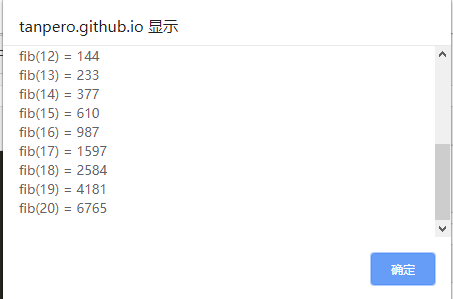

## 递归

---

### 递归的概念

大多数用于解决程序问题的算法策略都在计算领域之外有与之对应的事物。当你重复执行一个任务是，你就在使用迭代。当你做一个决定是，你正运用条件控制。由于这些都是人们熟悉的操作，大多数人在遇到相关的小问题时学会了使用 `for`、`while` 以及 `if` 这样的条件控制语句。

然而，在处理一些复杂的程序任务之前，必须学习一种强大的问题处理策略，它在现实世界中很少有直接对应的事物。这种策略被称为*递归*，它被定义为将大问题通过简化成*相同形式*的小问题来解决问题的一种技术。在递归定义中，“相同形式”这个词是最重要的，它的特殊之处在于：在解决方案中，子问题和原问题具有相同的形式。

当你第一次听到讲一个问题分解成相同形式的子问题的思想时，你可能会觉得它意义不大。不像重复或条件检验，递归不是日常生活中出现的一个概念。正因为它不常见，因此学习如何使用递归可能很困难。为此，你必须培养必要的直觉，这种直觉能够让递归看起来和其他所有的控制结构一样自然。对于刚开始学习编程的人来讲，理解递归需要大量的时间和练习。即便如此，努力学习使用递归无疑是值得的。**作为一种解决问题的工具，递归非常强大，以至于它有时看起来近乎神奇。使用递归使得用极其简洁的方式编写一个复杂的程序成为可能**。

为了更好地理解递归，想象一下：假如我们已经被任命为以各大慈善组织的资金协调员，这个组织有很多志愿者，但是缺乏资金。我们的工作就是筹集 1 000 000 人民币以满足组织的开支。

如果我们认识一些愿意捐献 1 000 000 人民币的人，我们的工作就很简单。但是，我们可能不会太幸运地拥有那些慷慨且为千万富翁的朋友。此时，我们必须一小笔一小笔地来筹集这 1 000 000 人民币。如果平均捐款为 100 人民币，我们可能会选择一个不同的行动方针：给 10 000 个朋友打电话，请求他们每人捐款 100 元。但话说回来，我们可能没有 10 000 个朋友，那么我们该怎么办呢？

最常见的情况时，当你面临一个超出你能力的任务，这个问题的答案就是将你的部分工作分派给其他人。我们的组织有相当多的志愿者。如果能够在这个国家的不同地区发现十个志愿者，然后任命他们为地区协调员，这 10 个人每人负责筹集 100 000 元。

筹集 100 000 元比筹集 1 000 00 元简单，但这也并非易事。我们任命的地区协调员应该做什么？如果他们采取相同的策略，他们进而将部分工作分派给其他人。如果他们每个人招募 10 名资金筹集志愿者，这些志愿者每人只需要筹集 10 000 人民币。这个分派任务的过程可以一直继续下去，直到志愿者能够自己筹集所分派的钱。由于平均捐款为 100 元，资金筹集志愿者可以从每个捐献者那里筹集 100 元，这就无需再分配任务。

这个筹集资金的策略大致可以归纳为以下结构：

```javascript
const collectContributions = n => {
    if (n <= 100) {
        从单个捐献者那里收集捐款
    } else {
        寻找十个志愿者
        指派每位志愿者筹集 n / 10 元
        将志愿者筹集到的钱收集起来
    }
}
```

其中最重要的是以下这行：

```javascript
指派每位志愿者筹集 n / 10 元
```

它只是简单地将原始问题的规模减小。任务的基本特征（筹集 n 元钱）问题依然和原来完全一样，唯一不同的是 n 的值变小了。此外，由于问题是相同的，我们可以调用原始的函数来求解它。因此，这里的思路可以写出下面的实际代码：

```javascript
collectContributions(n / 10);
```

如果平均捐款数大于 100 元，注意 `collectContributions` 函数调用自身的结束条件是非常重要的。在程序中**，一个函数直接或间接地调用自身**正是所定义的递归函数的重要特点。

`collectContributions` 函数的结构是典型的递归函数。通常，递归函数提都具有如下形式：

```javascript
if (测试是否满足条件) {
    停止使用递归，计算最简化的问题
} else {
    将问题分割为相同形式的小问题
    通过递归调用自身解决每个小问题
    将子问题解决方案重新组合成一个整体解决方案
}
```

这种结构提供了编写递归函数的模板，因此被称为*递归范型*。我们可以将这种技术运用到编程问题中，只要该问题符合以下条件：

1. 我们一定能够识别那些答案很容易就被确定的*简单情况*。
2. 我们一定能够确定一个*递归分解*，这个递归分解可以让我们将任何复杂问题分解成相同形式的更简单的问题。

`collectContributions` 这个例子说明了递归的强大。和任何递归技术一样，原始问题通过分解成更小的子问题来解决，子问题只是在规模上与原问题有差别。这里，原始问题是要筹集到 1 000 000 元。在第一级的分解中，每一个子问题是要筹集到 100 000 元。然后，这些问题进而被细分为更小的问题，直到问题足够简单，直至不需要再细分就能解决为止。由于该解决方法依赖于将复杂问题分解成相同形式的更简单的问题，因此，这种递归形式的解决方法通常被称为*分治*算法。


### 阶乘函数

尽管 `collectContributions` 这个例子说明了递归的思想，但是它并没有揭示递归在实际中是如何使用的，这大部分原因是组成解决方法的步骤，例如招募 10 名志愿者然后筹钱，都不能在 JavaScript 程序中简单地表示出来。为了得到对递归性质的一个实际理解，你需要思考那些更容易适用于编程领域的问题。

对于大多数人来说，理解递归最好的方法就是从简单的数学函数开始，其中，递归的结构直接伴随着问题的描述出现而很容易被理解。其中，最常见的是阶乘函数（数学上习惯表示为 $$n!$$ ），它被定义为在 1 到 n 之间的所有整数的乘积。在 JavaScript 中，使用 `for` 循环编写 `fact` 函数非常简单，正如以下实现代码所展示的：

```javascript
const fact = n => {
    let result = 1;
    for (let i = 1; i <= n; i += 1) {
        result *= 1;
    }
    return result;
};
```

该实现代码使用了一个 `for` 循环来循环遍历 1 到 n 之间的每个整数。而在递归实现中，并不存在这个循环，取而代之的是通过直接递归调用以产生相同的结果。然而，`fact` 的实现并没有利用阶乘的一个重要的数学性质。每一个数的阶乘都与下一个更小的整数的阶乘相关，如下所示：
$$
n! = n \times(n - 1)
$$
因此，$$4!​$$ 是 $$4 \times 3!​$$，$$3!​$$ 是 $$3 \times 2!​$$，以此类推。为了确保阶乘计算过程在某处终止，数学上定义了 $$0!​$$ 为 $$1​$$。因此，继承函数的传统数学定义如下：
$$
n! = 
\begin{equation}  
\left\{  
             \begin{array}{**lr**}  
             1 & 若 n = 0 \\
             n \times (n - 1)! & 其他
             \end{array}  
\right.  
\end{equation}  
$$
这个定义是递归的，因为它根据 $$n - 1$$ 的阶乘定义了 $$n$$ 的阶乘。新的问题（计算 $$n-1$$ 的阶乘）和原始的问题有同样的形式，这种形式是递归的基本特征。我们之后可以使用相同的过程根据 $$(n - 2)!$$ 来定义 $$(n -1)!$$ 。此外，我们可以一步一步地向前递推这个过程，直至解决方案被表达成 $$0!$$ ，根据定义 $$0!$$ 等于 $$1$$。

从程序员的观点来看，递归数学定义的实际影响是，它为其实现方法提供了一个模板，用 JavaScript 我们可以实现一个如下的计算其参数的阶乘函数 `fact` ：

```javascript
const fact = n => {
    if (n === 0) {
        return 1;
    } else {
        return n * fact(n - 1);
    }
};
```

如果 n 等于 0，`fact` 函数的结果为 1。如果 n 不等于 0，通过调用 `fact(n - 1)` ，然后将这个结果乘以 n 来计算结果。这个实现方式直接遵循了阶乘的数学定义，并且恰好具有递归结构。

当然，我们也可以用更简便的形式写出 `fact` 函数：

```javascript
const fact = n => {
    return n === 0 ? 1 : n * fact(n - 1);
};
```

简单测试一下 `fact` 函数，很显然，它像我们预期地那样计算出了正确结果。

```javascript
alert(fact(0));  // 1
alert(fact(1));  // 1
alert(fact(2));  // 2
alert(fact(5));  // 120
alert(fact(10)); // 3628800
alert(fact(50)); // 3.0414093201713376e+64
```

如果根据递归的数学定义，编写 `fact` 函数的实现无比简单，当我们第一次学习递归时，`fact` 的递归实现看起来遗漏了某些东西。即使它清楚地反映了数学定义，递归公式使我们难以确定实际的计算步骤。例如，当我们调用 `fact` 函数时，我们想要计算机给出答案，在这个递归实现中，我们能看到的只是一个公式，它将一个 `fact` 调用转化成另一个 `fact` 调用。由于计算步骤不明显，因此当计算机给出正确答案时，它看起来有点神奇。

现在，我们可以根据 `fact` 函数的实际计算步骤，将递归的过程演算一下。假设我们定义了 `fact` 函数，并写了一行 `alert("fact(4) = " + fact(4))`，那么接下来的演算如下所示：
$$
\begin{align}
 & fact(4) \\
 & = 4 \times fact(4 - 1) \\
 & = 4 \times fact(3) \\
 & = 4 \times (3 \times fact(3 - 1)) \\
 & = 4 \times (3 \times fact(2)) \\
 & = 4 \times (3 \times (2 \times fact(2 - 1))) \\
 & = 4 \times (3 \times (2 \times fact(1))) \\
 & = 4 \times (3 \times (2 \times (1 \times fact(0)))) \\
 & = 4 \times (3 \times (2 \times (1 \times 1))) \\
 & = 4 \times 3 \times 2 \times 1 \times 1 \\
 & = 24
\end{align}
$$
`fact(4)` 的返回值就是 24。由上面的演算过程可知：递归的计算过程实际上是将函数调用不断展开，直到参数符合某一终止条件（如 $$n = 0​$$），这个返回值是确定的，那么这次调用所在的表达式的值就确定了，以此类推，最后进行的只是单纯的数字运算。

包含 `fact(4)` 计算的完整跟踪过程的意义使我们确信：计算机将递归函数与其他函数同等对待。当我们面对一个递归函数时，至少在理论上，我们可以模拟计算机的操作，并且弄明白它将做什么。通过一步步演算，我们可以复制出完整的操作并给出答案。然而，如果我们这样做，我们会经常发现其过程的复杂性会以计算过程无法跟踪而结束。

每当我们试图理解一个递归程序时，将基本细节隐藏，取而代之的是应集中于某个层次上的操作是非常有用的。在那个层次上，我们可以假设：只要那层调用的参数在某种意义上比原始的参数简单，所有的递归调用都能自动得到正确的答案。这种心理上的策略（即假设任何更简单的递归调用将正确地工作）被称为*递归的稳步跳跃*。在实际应用中使用递归时，学会运用这种策略是非常重要的。


### 斐波那契函数

在 1202 年出版的《算法之书》（*Liser Abbaci*）中的一个数学模型中，意大利数学加列奥纳多·斐波那契提出了一个在很多领域，包括计算机科学领域都具有重要影响的一个问题，这个问题作为人口生物学中的一个例子被首次提出。斐波那契的问题是关于兔子的总数是如何一代一代地增长的，如果兔子生育是根据以下公认的规则进行：

- 每一对成年的兔子每个月生产一对新的兔子。
- 兔子在生下来的两个月之后变成成年兔子。
- 老的兔子永远不会死亡。

假设在某年的一月有一对新出生的兔子，当这年结束时共有多少兔子？

通过在这一年每个月记录下兔子的总数目，我们可以简单地解决这个斐波那契问题。在一月初，没有兔子，由于这个月的某个时候第一对兔子刚被引进，这导致了二月一号只有一对兔子。由于初始的这对兔子是新出生的，它们在二月的时候还没有成年，这意味着三月一号依然只有原来的那对兔子。然而，在三月，这对兔子到了生产的年龄，这也就意味着一堆新的兔子出生了。在四月一号的时候，这对新出生的兔子增加了种群的数量（若用“对”来计算的话，则达到了两对）。在四月，原来的那对兔子继续生产，但是三月出生的那对兔子还太年轻。因此，在五月开始的时候，这里有三对兔子。从此，随着每个月有越来越多的兔子，兔子的总数开始增加得越来越快。

此时，将迄今为止的数字按月总数记录成一个数字序列是非常有用的，这个序列用下标 $$t_i$$ 表示， $$t_i$$ 表示从某年的一月一号的实验开始到第 $$i​$$ 个月兔子的总对数。这个序列被称为*斐波那契数列*（Fibonacci sequence），且以下述项开始，它表示到目前为止的计算成果：

$$
\begin{array}
& t_0 & t_1 & t_2 & t_3 & t_4 \\
0 & 1 & 1 & 2 & 3
\end{array}
$$

我们可以通过仔细观察来简化这个数列中更多项的计算。由于问题中的兔子永远不会死亡，前一个月中所有的兔子在这个月中仍然存在。此外，每一对成年的兔子生产出一对新的兔子，能够繁殖的成年兔子的数量就是前一个月中所有兔子的数量。换句话说，序列中的每一项一定是前面两项之和。因此，斐波那契数列中接下来的几项看起来如下所示：

$$
\begin{array}
& t_0 & t_1 & t_2 & t_3 & t_4 & t_5 & t_6 & t_7 & t_8 & t_9 & t_{10} & t_{11} & t_{12} \\
0 & 1 & 1 & 2 & 3 & 5 & 8 & 13 & 21 & 34 & 55 & 89 & 144
\end{array}
$$
因此，这年结束时兔子的总对数是 144。

从编程的角度来看，它帮助我们使用下面更加数学化的形式来表达生成这一斐波那契数列新项的规则：
$$
t_n = t_{n - 1} + t_{n - 2}
$$
在这种类型的表达式中，一个序列的每个元素由其之前的元素确定，这被称为*递归关系*。为了应用这个公式，我们至少需要两个已知项，那么序列中开始的两项（$$t_0$$ 和 $$t_1$$ ）必须被明确地定义。因此，斐波那契数列完整的描述为：
$$
t_n = 
\begin{equation}  
\left\{  
             \begin{array} \\
             n & 若 n 是 0 或 1 \\  
             t_{n - 1} + t_{n - 2} & 其他
             \end{array}  
\right.  
\end{equation} 
$$
这个数学公式对于函数 `fib(n)` 的递归实现是一个理想的模型，它的作用是计算斐波那契数列中的第 n 项。`fib(n)` 的递归实现方式展示在如下的代码中，它同时包含了一段测试代码，用于显示斐波那契数列中两个给定的项。

```javascript
const MIN_INDEX = 0;  // 序列的第 0 项
const MAX_INDEX = 20; // 序列的第 20 项

const fib = n => {
    if (n < 2) {
        return n;
    } else {
        return fib(n - 1) + fib(n - 2);
    }
};

alert("这个程序将会展示斐波那契数列的前二十项");
let info = "";
for (let i = MIN_INDEX; i <= MAX_INDEX; i += 1) {
    info += `fib(${i}) = ${fib(i)}\n`;
}
alert(info);
```

我们获得了这样的输出。



我们已经有了演算 `fact` 函数计算过程的经验，现在让我们再尝试一下 `fib` 函数。例如，考虑一下，当调用 `fib(5)` 时将会发生什么？由于这里没有出现 `if` 语句中列举的简单情况，因此将通过执行以下语句得出计算结果。

```javascript
return fib(n - 1) + fib(n - 2);
```

它等价于以下语句：

```javascript
return fib(4) + fib(3);
```

此时，计算机计算 `fib(4)` 的结果，再加上调用 `fib(3)` 的结果而得到最终结果，然后作为 `fib(5)` 的值返回求和结果。而在计算 `fib(4)` 和 `fib(3)` 的时候，显然也使用了完全相同的策略，直到达到最简单的情况为止。在这里， `fib(4)` 是 3，`fib(3)` 是 2。因此，调用 `fib(5)` 的结果就是 $$3 + 2$$，即 $$5$$。我们不需要了解所有的细节，一些细节最好交给计算机去处理。


### 递归的效率与优化

然而，如果我们检查关于计算 `fib(5)` 调用的细节，我们很快会发现这个计算的效率是非常低的。递归分解产生了很冗余的调用，其中，计算机在多次计算斐波那契数列中相同的项后终止。下图展示了计算 `fib(5)` 所需的所有递归调用。正如我们从图中所看到的，这个程序最终调用了一次 `fib(4)` 、两次 `fib(3)`、三次 `fib(2)`、五次 `fib(1)` 以及三次 `fib(0)`。假设斐波那契函数可以用迭代高效地实现，则递归实现所需的指数级增长的步骤就有些令人烦恼。

<此处保留一张图片的位置>

在发现上述的 `fib(n)` 的实现效率很低之后，很多人都忍不住将矛头指向递归。然而，斐波那契例子的问题与递归本身无关，相反的是与递归的使用方式有关。通过采用一种不同的策略，我们可以使 `fib` 函数的性能得到极大提升。

使用递归时，避免低效是常态，其关键在于采用一种更通用的方法以找到一种更高效的解决方案。斐波那契数列并不是唯一的由以下递归关系定义其项的序列：
$$
t_n = t_{n - 1} + t_{n - 2}
$$
根据我们选择头两项的方式，我们可以产生许多不同的序列。传统的斐波那契数列：
$$
0, 1, 1, 2, 3, 5, 8, 13, 21, 34, 55, 89, 144, ...
$$
由定义 $$t_0 = 0$$ 和 $$t_1 = 1$$ 得到。而如果定义了 $$t_0 = 3$$ 和 $$t_1 = 7$$ ，取而代之，我们会得到以下序列：
$$
3, 7, 10, 17, 27, 44, 71, 115, 186, 301, 487, 788, 1275,...
$$


### 检测回文


### 间接递归


### 递归地思考


