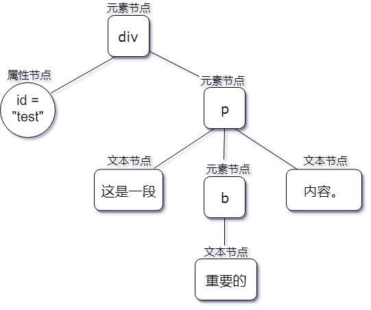
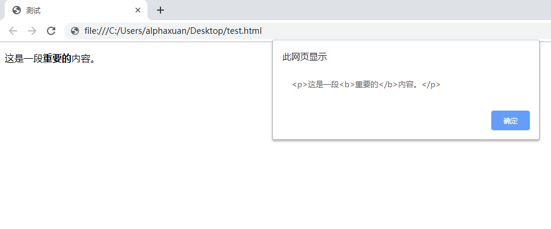
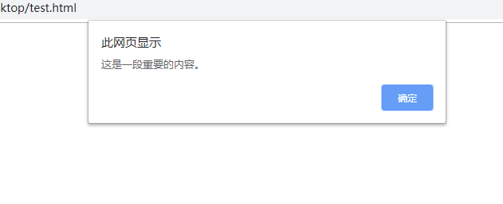

## DOM 操作

---

### 处理节点

在上一节中，我们浅显接触了一些 HTML 控件，Web 应用带来的精彩纷呈的体验就源于它们的灵活使用。而在我们自如调遣 Web 所提供的强大交互能力之前，还需要进一步了解一些 DOM 操作，它们比前述的内容更加深入，也是更加强大功能的基石。这一小节向我们描述了几种对 DOM 节点进行处理的常规方法。

**计算子节点**

目前我们有以下 HTML 片段。

```html
<body>
  <ul id="books">
    <li>《平凡的世界》</li>
    <li>《活着》</li>
    <li>《文化苦旅》</li>
    <li>《许三观卖血记》</li>
    <li>《悲惨世界》</li>
    <li>《复活》</li>
  </ul>
</body>
```

如果我们要计算 `<ul>` 中有多少子元素（即 `<li>`），DOM 提供了两种方法。

```javascript
const books = document.getElementById('books');
alert(books.children.length);   // 6
alert(books.childElementCount); // 6
```

两种方法产生相同的结果，但它们的意义有所区别。

- 第一种方法中，我通过 `children` 属性获得一个伪数组，里面存放着 `books` 的所有子元素，这个伪数组的 `length` 属性便是它包含的所有元素的数量。
- 第二种方法直接通过 `childElementCount` 获取子元素的数量，我认为这是一种意图更清晰和更易于维护的方式。过后查看代码时，它的字面含义“子元素的数量”一目了然。

我们也可以使用 `childNodes.length` ，但是结果却截然不同。

```javascript
const books = document.getElementById('books');
alert(books.childNodes.length); // 13
```

与 `children` 属性不同，`childNodes` 属性代表所有子节点的集合，包括*空白节点*。换句话说，当我们需要**所有元素节点**时，DOM  对象的 `children` 属性能做到这一点，并用 `childElementCount` 获取数量。当我们需要**所有子节点**时，则使用 `childNodes`。

**检查子节点的存在性**

DOM 对象提供了 `hasChildNodes` 方法来检查一个元素是否具有子节点，它返回一个布尔值。

```javascript
const books = document.getElementById('books');
alert(books.hasChildNodes()); // true
const aBook = document.getElementsByTagName('li')[0];
alert(aBook.hasChildNodes()); // true（有文本子节点）
```

如果把 `<ul id="books"></ul>` 中的 HTML 标签全部删除，但是留下空白，它就会拥有空白子节点，那么 `books.hasChildNodes()` 还会得到 `true`。为了确保`hasChildNodes`返回`false`，HTML 片段必须如下所示：

```html
<body>
  <ul id="books"></ul>  
</body>
```

现在得到的就是预期结果。

更多时候，我们会希望精准地知道一个元素是否拥有有效的子元素，那么我们可以先检查它是否存在子节点，然后查看子节点的 `nodeType` 属性来确定它是否为元素节点。

**访问特定节点**

有几种不同的方法可以针对位置关系访问特定节点。除了使用 `children` 或 `childNodes` 获得“一堆”子节点之外，还有其它一些选择。

- `firstElementChild`：访问第一个子元素
- `lastElementChild`：访问最后一个子元素

让我们再来看看这个例子。

```html
<body>
  <ul id="books">
    <li>《平凡的世界》</li>
    <li>《活着》</li>
    <li>《文化苦旅》</li>
    <li>《许三观卖血记》</li>
    <li>《悲惨世界》</li>
    <li>《复活》</li>
  </ul>
</body>
```

现在让我们分别定位第一个和最后一个元素。

```javascript
// 这里的 innerHTML 属性可供查看元素的内容
const books = document.getElementById("books");
alert(books.firstElementChild.innerHTML); // "《平凡的世界》"
alert(books.lastElementChild.innerHTML);  // "《复活》"
```

如果我们想获取别的子元素，可以**先得到一个子元素**，然后**访问它的兄弟元素（sibling element）**。这里分别借助 `firstElementChild` 和 `lastElementChild` 确定首尾子元素，再使用 `previousElementSibling`和`nextElementSibling`属性获取“下一个兄弟元素”和“上一个兄弟元素”。


```javascript
const books = document.getElementById("books");
alert(books.firstElementChild.nextElementSibling.innerHTML);    // "《平凡的世界》"
alert(books.lastElementChild.previousElementSibling.innerHTML); // "《悲惨世界》"
```

`document.head` 和 `document.body` 两个对象分别对应页面中唯一的 `<head>` 与 `<body>` 元素，它们之间的关系也显而易见。

```javascript
// <head> 后面跟着 <body>
alert(document.head.nextSibling);     // HTMLBodyElement（<body> 元素对象的名称）
// <body> 前是 <head>
alert(document.body.previousSibling); // HTMLHeadElement（<head> 元素对象的名称）
```

DOM 提供了对子元素、兄弟元素的访问操作，是否还为父元素预留了位置呢？当然！`parentElement` 得到的就是一个元素的父元素的对象。

```javascript
const books = document.getElementById("books");
// <ul id="books"> 外面是 <body>
alert(books.parentElement);      // HTMLBodyElement
alert(document.body.parentNode); // HTMLHtmlElement（<html> 元素对象的名称）

// document.documentElement 对象代表“整个文档”，也就是整个 <html> 元素及其所有子元素
alert(document.body.parentNode === document.documentElement); // true
```

综上所述，一个位于 `<body>` 中的普通元素，它的层次关系大致如下图所示。


根据普通节点与元素节点相关方法的对应关系，DOM 也提供了类似的`firstChild`，`lastChild`，`previousSibling`，`nextSibling`和`parentNode`属性。这些属性获取所有类型的节点，而不仅仅是元素节点。在实践中，我们一般只关注对元素节点的处理。


### 动态创建内容的原始方法

我们此前见过的绝大多数 DOM 方法与属性都只能用来查找元素。`getElement(s)By(xxx)` 类方法可以方便快捷地找到文档中某个或某些特定的元素节点，这些节点随后又可以通过 `setAttribute` 设置属性。元素或节点对象的一些属性又可以获得另一些相关的元素或节点对象。在这些示例中，Web 页面的结构由 HTML 负责创建，由 JavaScript 负责操作某些细节，其中最为重要的就是用 JavaScript 来操控 DOM ，改变页面的结构和内容。这一小节里我们将学习一些 DOM 方法，通过创建新元素和修改现有元素来更新文档。

在正式开始利用 DOM 方法来操作文档前，我们先回顾两个在前面章节中使用到的技术：`document.write` 和 `innerHTML`。

**document.write**

`document.write` 方法可以快捷地把字符串插入到文档里。

我们建立一份 HTML 文件，里面保存如下内容，文件名可以定为 `test.html`。

```html
<!DOCTYPE html>
<html>
    <head>
        <meta charser="utf-8" />
        <title>测试</title>
    </head>
    <body>
        <script>
            document.write("<h1>这是一个标题</h1><p>这是一段文本</p>");
        </script>
    </body>
</html>
```

在 Web 浏览器里加载这个页面，我们会看到如下的内容。


`document.write` 最大的问题是，它混淆了“内容呈现”与“逻辑”的界限，违背了“行为与表现分离”的原则，把原本应该由 HTML 本身做的事情硬生生搬进了 JavaScript 代码，在这种情况下写出的 HTML 往往会产生格式混乱，难以维护。使用 `document.write` 除了初学时用于打印输出的一点方便之外，实在带来不了什么好处，请尽量避免使用它。

**innerHTML 属性**

DOM 元素对象的 `innerHTML` 属性始于微软的 Internet Explorer 4 浏览器，此后逐渐被其他浏览器所接受，最终纳入了 HTML5 标准。`innerHTML` 可以读、写给定元素的 HTML 内容。为了查看它所发挥的效用，我们把这段代码插入 `test.html` 的 `<body>` 部分。

```html
<div id="test">
    <p>这是一段<b>重要的</b>内容。</p>
</div>
```

根据 DOM 分析一下这个 `<div>` 的结构，



`<div>` 元素的 `id` 是 `test`，它包含一个元素节点（`<p>` 元素），这个 `<p>` 元素又有一些子节点。其中有两个文本节点，值分别是 `"这是一段"` 和 `"内容"`。还有一个元素节点（`<b>` 元素），`<b>` 元素本身包含一个文本节点，这个文本节点的值是 `"重要的"`。

DOM 为这个元素提供了一幅包含大量细节的图画，使用 DOM 提供的方法和属性可以对任何一个节点进行单独的访问，而 `innerHTML` 属性不需要考虑太多节点之间的关系，直接把元素的内容作为一段字符串交给我们，同时也可以把新的 HTML 源文本填充进去，作为元素的内容。这里，`<div id="test">` 中包含着 `"<p>这是一段<b>重要的</b>内容。</p>"` 这样一段 HTML 字符串。


在 HTML 源文件的 `<script>` 标签里加入下面的内容。

```javascript
window.onload = () => {
    const test = document.getElementById("test");
    alert(test.innerHTML);
};
```

刷新浏览器页面，可以看到 `innerHTML` 中包含的内容被以字符串的形式显示出来。



显然，`innerHTML` 属性不会考虑多少 DOM 的细节，它把 DOM 内容当做字符串，而不是具有精巧结构的模型。它就像一把大锤一样粗放，而标准的 DOM 操作，则像在层层叠加的结构中，小心穿行的手术刀。`innerHTML` 的用武之地在于它的高效率：要考虑的细节少了，将 DOM 以文本这一最本质的存在形式直接搬运。

如果要把一大段 `HTML` 文本插入页面中，`innerHTML` 是一个值得考虑的选择。它既支持读取，又支持写入，我们不仅可以读出元素包含的 HTML 内容，还可以像拼贴画一样把新的 HTML 粘进去。

现在，我们清空 `<div id="test">` 元素内包含的内容，变成一个空元素，再把下面这段 JavaScript 代码放入 `<script>` 标签中，取代之前的代码。

```javascript
window.onload = () => {
    const test = document.getElementById("test");
    test.innerHTML = "<p>这是一段<b>重要的</b>内容。</p>";
}
```

页面刷新后，我们便可以看到如下的效果。


对 `innerHTML` 属性进行赋值会使得元素中所有 HTML 内容都被替换为新的字符串。如果我们不是为了更改元素中所有的内容，而是附加几行说明文字或一个控件，可以将赋值操作符更改为 `+=` 。

```javascript
window.onload = () => {
    const test = document.getElementById("test");
    test.innerHTML = "<p>这是一段<b>重要的</b>内容。</p>";
    test.innerHTML += "<br />";
    test.innerHTML += "<p>这段内容是<i>附加的</i>。</p>";
}
```

在需要往 DOM 中插入一大段内容时，`innerHTML` 可以帮助我们又快又简单地完成这一任务。如果需要对插入的内容进行进一步处理，我们就需要使用 DOM 提供的更加精确的方法与属性。`innerHTML` 属性并没有发挥出 DOM 作为一个模型的优雅，而在任何时候，标准的 DOM 操作都可以用来替代 `innerHTML` 属性。虽说这往往要多编写一些代码才能获得相同的效果，但其所拥有的、更高的精准性和更强大的功能不容小觑。

**innerText**

另一个和 `innerHTML` 有些类似的属性是 `innerText`，不同的是，访问它只会获得元素中所有纯文本内容，忽略所有尖括号标签。将文本写入 `innerText` ，即使里面包含了合法的 HTML 标签，也依然会被视作纯文本，原样呈现。

```javascript
window.onload = () => {
    const test = document.getElementById("test");
    alert(test.innerText);
    test.innerText = "<p><b>点击这个</b><button>按钮</button></p>";
}
```

上述代码会带来如下的效果。




### 动态创建内容的高级方法

作为一份文档的逻辑表示，DOM 所包含的信息与文档里的信息一一对应，DOM 树上任何一个节点的细节，都可供我们随时取用。

DOM 就像一条双向车道，不仅可以获取文档的内容，也可以更新文档的内容。改变了 DOM 树之后，文档呈现出的页面效果也会随之发生改变。例如 `setAttribute` 方法可以改变 DOM 节点树上的某个属性节点，页面就有了相应的变化。不过 `setAttribute` 方法并没有改变文档的*物理内容*，也就是我们用文本编辑器而不是浏览器打开一份 HTML 源文件所看到的。磁盘上排列的数据并没有发生改变，一切都是在浏览器运行时加载页面后执行脚本做出我们想要的更改。浏览器把 HTML 从磁盘或网络上读取出来，根据它读到的内容生成 DOM 树，在此之后一切操作都围绕着这课 DOM 树进行，它是一份文档在内存中的抽象结构，在浏览器看来，DOM 树才意味着文档本身。

所以，以动态方式在文档加载后（即生成 DOM 树后）创建文档内容也就很好理解。我们并不是在“往 HTML 源文件中塞新标签”，而是在改变代表此刻页面一切内容的 DOM 树。我们思考的角度就是 DOM 的结构本身。

在 DOM 看来，一份文档是一棵由节点构成的 DOM 树在屏幕上的映射。如果想往 DOM 这棵节点树上添加内容，就必须插入新的节点。如果想插入一些标签，对应在 DOM 树上就是插入元素节点。

**createElement 方法**

我想把一段文本插入 `<div id="test">` 元素。对应到 DOM 的思考方式中，就是添加一个 `<p>` 元素的节点，把这个节点作为 `<div id="test">` 元素的一个子节点。这项任务需要分成两个步骤完成。

1. 创建一个新的元素。
2. 把这个新元素插入 DOM 树。

第一个步骤要用 DOM 方法 `createElement` 来完成，它的使用方法如下：

```javascript
document.createElement(元素名称);
```

因此，创建一个 `<p>` 元素，只需要像这样调用它。

```javascript
document.createElement("p");
```

这个方法不会改变页面效果，它只是在内存中创建了一个元素对象，在它成为 DOM 树的一份子之前，我们还需要把它插入到文档中。因此，我们应该有一个标识符来标记这个新创建出来的元素对象。

```javascript
const paragraph = document.createElement("p");
```

由于 `paragraph` 这个标识符被确定为**一个元素对象的名称**，它就不应该被改变，以防因为疏忽而造成意想不到的后果，我们把它声明为一个常量。常量 `paragraph` 现在代表刚刚创建出的 `<p>` 元素的对象，此时它还不是 DOM 树的组成部分，而是游荡在 JavaScript 的世界里的一个孤儿。这个 `<p>` 元素的对象被称为*文档碎片*（document fragement），此时它不会对文档的“现实世界”产生任何影响，不过它已经像任何其他的节点那样拥有了自己的 DOM 属性。

这个无家可归的 `<p>` 元素现在已经有一个 `nodeType` 属性和 `nodeName` 属性，我们可以用一段代码来查看。

```javascript
window.onload = () => {
    const paragraph = document.createElement("p");
    let info = `nodeName: ${paragraph.nodeName}  nodeType: ${paragraph.nodeType}`;
    alert(info);
}
```

新节点已经被创造出来了，它有一个值为 `"P"` 的 `nodeName` 属性和值为 `1` 是 `nodeType` 属性，这两个值说明它是一个 `<p>` 元素节点。接下来，我们要把它嫁接到文档上去了。

**appendChild 方法**


**createTextNode 方法**


**一个组合的实践**


### 案例研究：互联网手册

