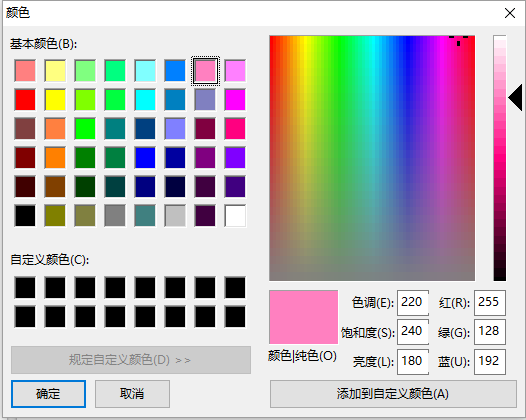

## HTML 控件

---

### 控件的概念

*控件*（widget）是一个很广泛的概念，它的字面含义是“可以由用户控制的组件”，包括你在使用桌面和 Web 应用时看到的那些按钮、文本框、滑动条、图片、菜单等。它们为用户和应用程序提供了一个便捷的交流途径，合适的控件使应用程序的意图得以良好传达，给用户以良好的使用体验。所有页面上的元素，只要能对用户进行的一定操作进行相应，进行相应的处理和改变状态，或专门负责传达某一类信息，都可以被称为控件。

开发者在使用控件时，应当考虑两大因素，一是**语义清晰**，而是**用户友好**。按钮就是一类语义非常清楚的控件，当用户看见它时，就会知道应该点击它来达到一定目的。所有的按钮都是基于这种固有经验。在此基础上，承担不同任务的按钮可能会被赋予不同的样式或提示信息。按钮中间可以显示点说明作用的文本。

```html
<button>
    点击我！
</button>
```

在大多数 Web 浏览器上，一个默认的按钮都会呈现为灰色的矩形方块，静止状态、鼠标移上、点击时、点击后对应的效果都会发生改变，体现了按钮操作时的质感。（在作者所使用的的浏览器上只会发生光影变化）


另一对例子是*单选按钮*和*下拉菜单*。单选按钮与普通的按钮有所不同，相信你一定见过它：


如果要让用户在三四个选项里做出唯一选择，显然单选按钮是很合适的。当用户改变要改变选择时，只需要点击另一个选项前的圆框。但是选项和内容一多，全部平铺堆积在页面上，看上去显得杂乱无章。当用户不需要做出选择时，还会带给用户冗余的视觉信息。


而下拉菜单默认状态下只会显示一行文本，当我们单击它时，就会弹出所有的选项——我们知道它弹出的内容不是通知或别的什么东西，而是供我们做出选择的选项。显示选项让用户做出选择，是单选按钮和下拉带单共有的语义。但当用户不需要做出选择时，下拉菜单会隐藏大部分内容，等到时机合适时再显示，不会给用户做出视觉上的困扰，这时下拉菜单就比单选按钮更加用户友好。而只有少量选项时，单选按钮要求用户做的事情更加一目了然，省去了单击才能显示所有选项的步骤，这时单选按钮比下拉菜单更加用户友好。

编写 HTML 是显示控件的一种基本方式。HTML 页面上可以使用的控件有十几种，我们将在下文中了解到大部分控件的具体使用。


### 生成控件的元素

HTML 中有许多元素和属性可以生成特定的控件。其中一个重要的元素是 `<input>`，它本身在默认情况下会显示为一个空白的单行纯文本输入框（简称*文本输入框*），我们通常将它的 `type` 属性设置为 `"text"` 来强调它是一个“输入纯文本”的控件。通过将 `type` 属性设置为不同的值，`<input>` 元素所产生的控件外观与作用也各不相同。在前面的温度转换器示例中，我们使用了文本输入框与数字输入框两类控件用于接收用户输入。其中，数字输入框在点击后，右侧会显示一对上下箭头，我们可以借助于此对输入的数值进行微调。


另一个我们见过的控件是按钮。它也可以被视为输入控件的一种，因此

```html
<input type="button" value="点击我" />
```

 会被渲染为：


不过更方便的写法还是直接使用 `<button>` 元素：

```html
<button>点击我</button>
```

在互联网中用户交互对控件的需求远不止触发按钮与文本和数字输入。通过*颜色选取控件*，我们可以在游戏中选择今天穿的衣服的颜色，抑或是给个人主页换个背景色。

```html
今天用什么颜色的口红呢？当然是 <input type="color" />
```

它在我的 Chrome 浏览器上呈现为一个颜色按钮，单击它后会打开一个对话框来让我们选择颜色。



控件获取到的颜色以*HTML颜色格式*存放，关于颜色与颜色格式的相关知识我们会在第十章详细了解。

日期和时间输入同样是一类非常常见的需求。以前，页面只能提供给用户一个简陋的文本输入框，让用户自己来输入日期和时间，再根据规定的格式进行解析，如果格式写错了还会遇到意想不到的麻烦。现在 HTML 提供了一类日期和时间输入控件，它们外观上呈现为一个文本框，其中包含了预定的日期或时间格式。为了适应具体的需要，它们还分为不同的类型。

```html
我的生日：<input type="date" />
```

还可以用 `min` 和 `max` 属性为日期范围添加限制。

```html
请输入一个建国以前的日期：<input type="date" max="1949-9-30">
请输入一个21世纪的日期：<input type="date" min="2001-01-01">
```

我们可以用类似于数字输入框的上下箭头，对年月日等每一项进行微调，也可以在控件里找到一个图标，触发浏览器提供的简单日历以自由选择。


还有几种日期和时间控件，可以根据需要进行使用。

- ` <input type="datetime-local">` 提供一个类似上面的控件，不过它会忽略时区，只考虑本地时间。

- `<input type="time">` 可以用上下箭头选择一个时刻。

  （它也可能会提供一个时刻选择器，不过我的浏览器上没有 D-:）

- `<input type="month">` 精确到具体月份。

- `<input type="week">` 要求用户选择某一周。

`<input type="range">` 提供了一个滑块，可以让我们在规定范围内选择一个值，`min` 和 `max` 属性分别确定了这个范围的最小值和最大值，而 `step` 属性还可以控制每次递增或递减的程度。

```html
对 TFBoys 的好感度（0-100）：<input type="range" min="0" max="100" step="2">
```

我们对 TFboys 的好感度默认从 `50` 开始，每次至少增加或减少 `2` ，上限为 `100`，下限为 `0`。


如果我们的数据很多，写在文件里，怎么告诉页面呢？打开文件复制内容并粘贴到输入框里吗？

当然不用！我们有*文件选择控件*：`<input type="file">`

默认状态下，控件的外观是这样的：


标有“选择文件”的按钮和其后的文本都包含在控件里，单击一下，浏览器会唤起一个文件选择对话框，就像我们在 Office Word 等文档编辑软件里做的那样，选择文件并确定，控件便会显示出刚才读取到的文件的文件名。读取文件后进行的处理过程超出了本章范畴，我们将在后续有关数据处理的章节中详细了解。

以上控件能大致满足我们的基本需求，但是 Web 标准的制定者们在人性化方面做得更好，一个实践是需要用户“输入”的内容，变为只需“选择”，为 Web 应用程序的交互提供了莫大方便。我们在上一小节中见过的单选按钮、复选框和下拉菜单就是例子，它们已经在无数应用程序中发挥了重要作用，让网络投票与问卷这类特定需求变得方便快捷。