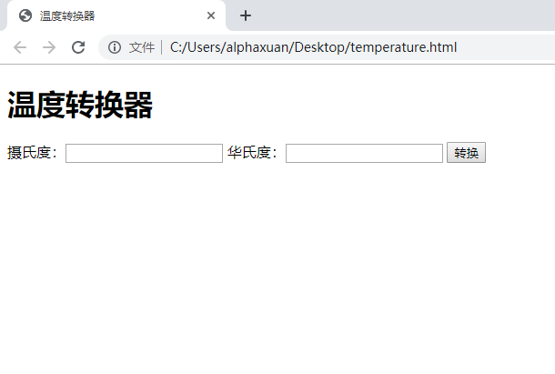

## 事件的概念

---

我们已经在学习初期接触到了 HTML 的概念，如前文所述，HTML 是 Web 页面的基本组成，接下来我们的任务将变得新奇有趣：抛开运行器窗口的拘束吧！让我们在自己的 HTML 页面中展现出 JavaScript 的力量。

在前面的一些示例中，我们简单了解了温度转换的算法，现在可以结合 HTML 写出一个温度转换器的小程序。



还记得怎样使用 HTML 文件吗？我们在 HTML 文件中输入以下代码：

```html
<!DOCTYPE html>
<html>
    <head>
        <meta charset="utf-8" />
        <title>温度转换器</title>
    </head>
    <body>
        <h1>温度转换器</h1>
		摄氏度：<input type="text" id="c" />
		华氏度：<input type="text" id="f" />
		<button id="c-to-f">℃ to ℉</button>
		<p id="result"></p>
    </body>
</html>
```

接下来保存并在浏览器中打开它，一个简单的温度转换器就呈现在了我们眼前。

这个 HTML 页面比我们在前面所看到的要复杂一些，因为我们将在这一章中了解到更多实用的概念。这里我们务必认识几个新的 HTML 标签：

- `<h1>温度转换器</h1>` 这是一个 `<h1>` 标签，它的作用是在页面上产生一个*一级标题*——就像我们在文档处理软件中所用到的那样。
- `<input type="text" id="c" /> ` 这是一个 `<input>` 标签，它的*类型*是 `text`，这会在页面上显示一个*文本输入框*。这里我们将它的 `id` 属性设置为 `"c"` ，说明它将会用来输入摄氏度的值。后面的华氏度输入框与此类似。
- `<button id="try">转换</button>` 是一个*按钮*，就像它的外观所呈现的那样，用于传达用户的操作要求。

可以看到，上面的 HTML 元素组成了一个温度转换器的页面，我们可以在输入框中输入数字。但是，我们点击“转换”的按钮时，却不会产生任何效果。显然，我们还需要添加相应的 JavaScript 代码，才能使这个简单的**应用程序**运行起来。加入  JavaScript 后的代码如下：

```html
<!DOCTYPE html>
<html>
    <head>
        <meta charset="utf-8" />
        <title>温度转换器</title>
    </head>
    <body>
        <h1>温度转换器</h1>
		摄氏度：<input type="text" id="c" />
		华氏度：<input type="text" id="f" />
		<button id="c-to-f">℃ to ℉</button>
		<p id="result"></p>
        <script>
        	const c = document.getElementById("c");
            const button = document.getElementById("c-to-f");
            const result = document.getElementById("result");
            
            const c2f = (value) => value * 1.8 + 32;
            
            button.onclick = () => {
                result.innerHTML = c2f(parseFloat(c.value));
            };
        </script>
    </body>
</html>
```

看起来有许多新的东西！不要着急，它们的含义都十分简单 ;-)

在 HTML 中，我们已经有了一个 `id` 为 `c` 的输入框，但是 JavaScript 并不知道这件事情！所以我们要在 JavaScript 代码中呼唤它的名字（`id`），召唤它闪亮登场。这个召唤的法术交给 `document.getElementById` 这个方法来做。`getElementById` 就是 “get element by id” 的*驼峰式*拼写形式，意为“通过 `id` 来获取元素。这样，我们就通过元素的 `id` 得到了这个元素。其后的 `button` 和 `result` 也是同理。

在第三章中，我们见过了摄氏度转换为华氏度的公式：

$$ F = C \times1.8 +32 $$

函数 `c2f` 根据这个公式完成计算。

---

Note：

英语中，把 A “转换” 为 B 可以写作 “A to B”。由于英语单词 "two" 和 "to" 发音相同，因此数字 2 是单词 to 的常见替代形式，“c2f” 即 “c to f”。

---

接下来是这个小程序最核心的部分：

```javascript
button.onclick = () => { 
     result.innerHTML = c2f(parseFloat(c.value));
};
```

我们可以从用途猜测它的含义：当我们*点击*（click）一个按钮时，会期望按钮做一些事情。需要做的事情写在一个函数里，当这个按钮被单击时（`onclick`），就执行这个函数。函数所做的事情自然也不足为奇：首先获取到摄氏度输入框的里的值（`c.value`），由于它是一个字符串，所以把它转换为数字方便进行计算，再用 `c2f` 转换为相应的华氏度值。最后，让它在 `result` 上显示出结果。就是这样！

