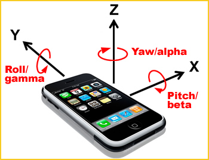

## 移动设备事件

---

### 触摸和手势事件

“移动设备”这个词的历史比我们所想象的还要悠久，它最初始于移动的车辆之间的通信实验，那个时候，更确切的叫法是“移动电话”。1926年，在柏林和汉堡之间的路线上，德国国家铁路上的头等舱乘客获得了首个成功的移动电话服务。1973年，摩托罗拉的 Martin Cooper 博士在重量为 1.1Kg 的设备上进行了首次公开移动电话通话。它是世界上第一部真正意义上的“移动设备”，是我们口中的“手机”的先驱。其后的三十年里，人类在移动设备的洪荒中开不断开辟着将为后世带来深远影响的新技术，包括短信、铃声下载、表情符号等。2003年，3G 标准开始在全球范围内采用，“移动互联网”这个词诞生了。移动设备的前置技术，逐渐在数十年的静默发展中积蓄了足够的力量。

在本章中，我们所说的移动设备，都是指从 2007 年开始所有继承了远古时代第一台 iPhone 的产品，这些产品更广为人知的名字叫**智能手机**。多年以后，我们仍然会记得，2007 年的 Apple 发布会上，iPhone 首次亮相的那一天。在乔布斯先生的手上，我们看到了一个崭新的时代。智能手机成为了移动设备真正的发展方向，

在移动设备上，浏览器会我们提供一类全新的事件，用以发挥出移动设备自身的强大特性。

### 姿态和方向事件

移动设备朝向的改变可以被*姿态传感器*捕捉到，进而触发*姿态事件*。通过姿态传感器提供的信息，我们可以知道设备的哪一面朝上摆放。姿态传感器还可以检测出设备相对于三条坐标轴的旋转情况，就如同一个陀螺仪一样。一些设备，如 Apple iPhone 和 iPad，还配置了*磁力传感器*，它可以提供设备摆放的精确方向。围绕着 $$x$$轴、$$y$$轴和$$z$$轴的旋转，可以分别表示移动设备的前后倾斜角度（beta）、左右旋转角度（gamma）和平面朝向（alpha）。

> 图片来源：Hillcrest Labs

### 运动事件

### 网络状态事件

